# COMPASS Architecture Visualization

This document provides visual representations of the COMPASS framework architecture using Mermaid diagrams.

## System Architecture

## SLAP Pipeline Flow

## Self-Discover Loop

## Component Interaction Flow

## oMCD Resource Allocation

## Integrated Intelligence Components

```mermaid
mindmap
    root((Universal Intelligence))
        Learning
            Q-Learning
            Transfer Learning
            Adaptability
        Reasoning
            Bayesian
            SLAP Advancement
            Logical Inference
        NLU
            Semantic Analysis
            Intent Extraction
            Context Understanding
        Uncertainty
            Entropy Calculation
            Confidence Estimation
            Risk Quantification
        Evolution
            Fitness Evaluation
            Diversity Metrics
            Selection
        Neural
            Activation Functions
            Feature Weighting
            Non-linear Mapping
```

## Data Flow

## SMART Objective Lifecycle

## Configuration Hierarchy

## Execution Timeline

---

## Legend

- **Solid Lines**: Direct data/control flow
- **Dashed Lines**: Feedback or memory access
- **Colors**:
  - Blue: Input/Output
  - Yellow: Metacognitive layer
  - Pink: Reasoning layer
  - Green: Intelligence layer
