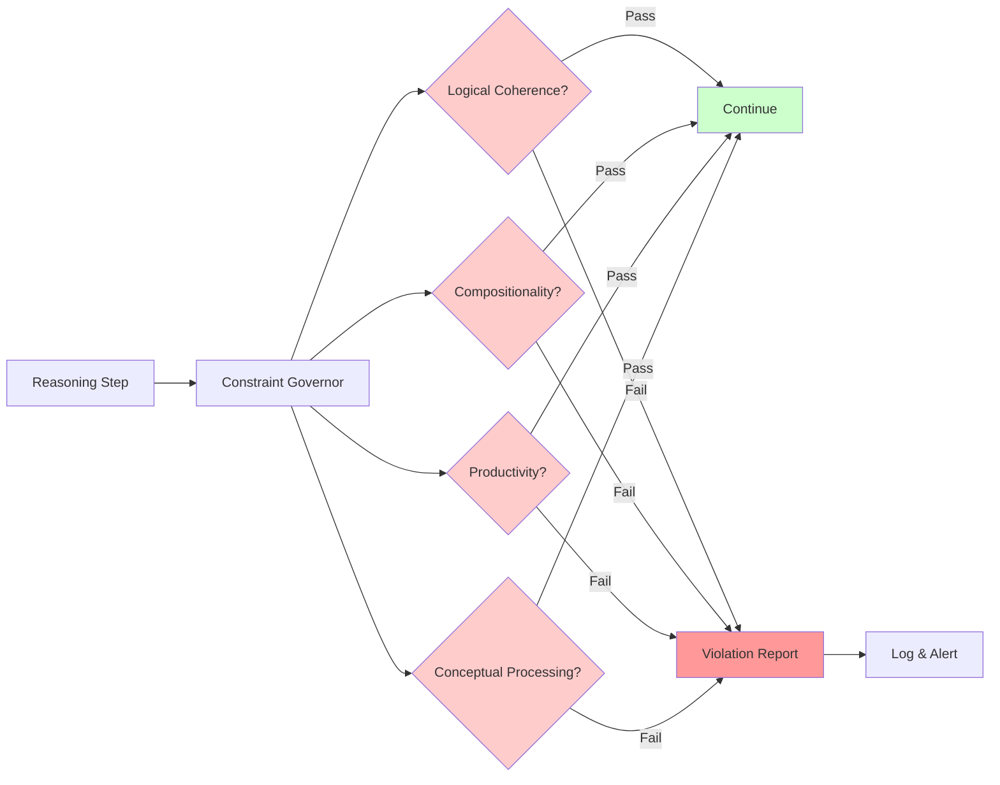
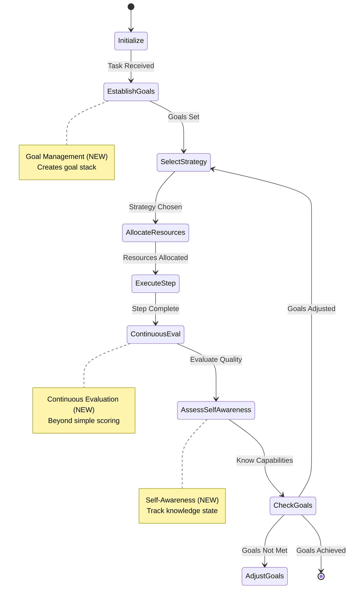
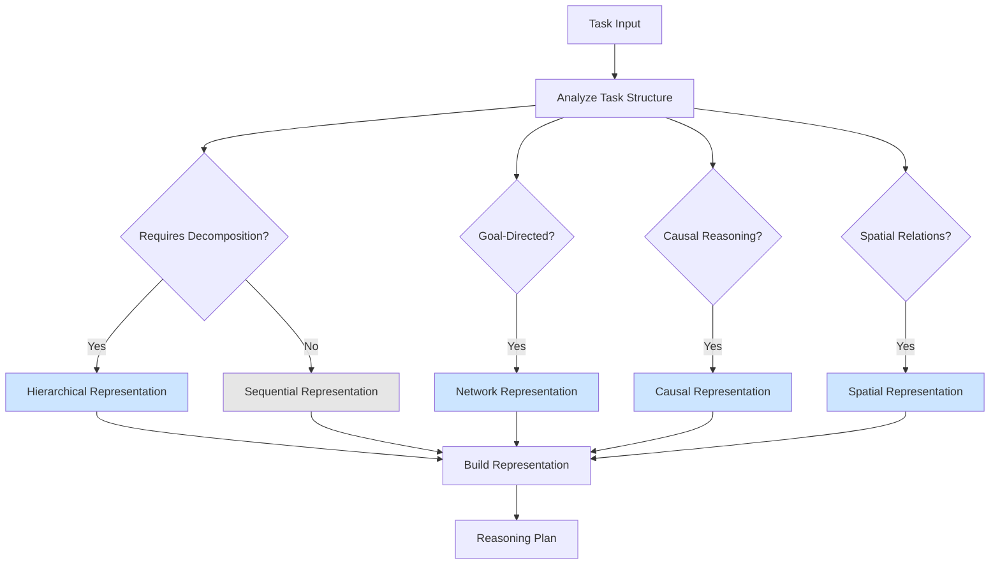
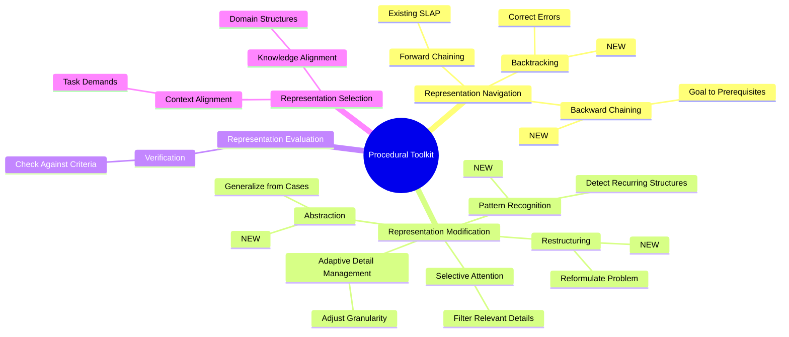
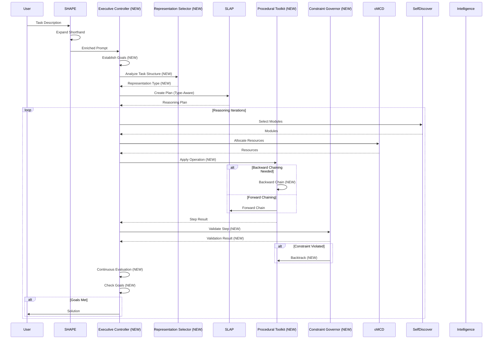

# CGRA-Enhanced COMPASS Architecture

Visual representation of how CGRA integrates into the COMPASS framework.

## Unified System Architecture

```mermaid
graph TB
    subgraph "USER INTERFACE LAYER"
        UI[User Input] --> SHAPE[SHAPE Processor]
        SHAPE --> |Enriched Prompt| META
    end

    subgraph "CGRA CONSTRAINT LAYER - NEW"
        CG[Constraint Governor]
        CG --> |Validates| INV[Invariants]
        INV --> LC[Logical Coherence]
        INV --> COMP[Compositionality]
        INV --> PROD[Productivity]
        INV --> CP[Conceptual Processing]
    end

    subgraph "META-COGNITIVE CONTROL LAYER - ENHANCED"
        META[Executive Controller - NEW]
        META --> OMCD[oMCD Resource Allocation]
        META --> SD[Self-Discover Reflection]
        META --> GM[Goal Management - NEW]
        META --> EVAL[Continuous Evaluation - NEW]
        META --> SA[Self-Awareness - NEW]
        META --> CA[Context Awareness - NEW]
    end

    subgraph "DYNAMIC WORKSPACE LAYER - ENHANCED"
        DW[Dynamic Workspace - NEW]
        DW --> RS[Representation Selector - NEW]
        RS --> |Selects Type| REP[Representation Type]
        REP --> SEQ[Sequential - Existing]
        REP --> HIER[Hierarchical - NEW]
        REP --> NET[Network - NEW]
        REP --> SPATIAL[Spatial - NEW]
        REP --> CAUSAL[Causal - NEW]

        DW --> SLAP[SLAP Pipeline - Enhanced]
        DW --> SMART[SMART Planner]
    end

    subgraph "PROCEDURAL TOOLKIT LAYER - NEW"
        PT[Procedural Toolkit - NEW]
        PT --> BC[Backward Chaining - NEW]
        PT --> BT[Backtracking - NEW]
        PT --> RS2[Representational Restructuring - NEW]
        PT --> PR[Pattern Recognition - NEW]
        PT --> ABS[Abstraction - NEW]
        PT --> FC[Forward Chaining - Existing]
    end

    subgraph "EXECUTION LAYER"
        II[Integrated Intelligence]
        II --> LEARN[Learning]
        II --> REASON[Reasoning]
        II --> NLU[NLU]
        II --> UNC[Uncertainty]
    end

    SHAPE --> META
    META --> |Coordinates| DW
    DW --> |Uses| PT
    PT --> |Executes| II
    II --> |Result| OUTPUT[Output]

    CG -.-> |Validates All Steps| META
    CG -.-> |Validates| DW
    CG -.-> |Validates| PT
    CG -.-> |Validates| II

    OUTPUT --> |Feedback| SHAPE

    style UI fill:#e1f5ff
    style OUTPUT fill:#e1f5ff
    style CG fill:#ffe6e6
    style META fill:#fff4e1
    style DW fill:#ffe1f5
    style PT fill:#e6f5ff
    style II fill:#e1ffe1
```



## CGRA Module Details

### Constraint Governor (Reasoning Invariants)



### Executive Controller (Meta-Cognitive Control)



### Dynamic Workspace (Representation Flexibility)



### Procedural Toolkit Operations



## Integration Flow Diagram



## CGRA Cognitive Elements Coverage

### Mapped to COMPASS Components

| CGRA Element | Implementation | COMPASS Component |
|--------------|----------------|-------------------|
| **Reasoning Invariants** | | |
| Logical Coherence | Constraint Governor | `constraint_governor.py` |
| Compositionality | Constraint Governor | `constraint_governor.py` |
| Productivity | Constraint Governor | `constraint_governor.py` |
| Conceptual Processing | Constraint Governor | `constraint_governor.py` |
| **Meta-Cognitive Controls** | | |
| Self-Awareness | Executive Controller | `executive_controller.py` |
| Context Awareness | Executive Controller | `executive_controller.py` |
| Strategy Selection | Executive Controller + Self-Discover | Enhanced module selection |
| Goal Management | Executive Controller + oMCD | Enhanced `omcd_controller.py` |
| Evaluation | Executive Controller | `executive_controller.py` |
| **Reasoning Representations** | | |
| Sequential Organization | SLAP Pipeline (existing) | `slap_pipeline.py` |
| Hierarchical Organization | Dynamic Workspace | Enhanced `slap_pipeline.py` |
| Network Organization | Dynamic Workspace | Enhanced `slap_pipeline.py` |
| Ordinal Organization | Dynamic Workspace | Enhanced `slap_pipeline.py` |
| Causal Organization | Dynamic Workspace | Enhanced `slap_pipeline.py` |
| Temporal Organization | Dynamic Workspace | Enhanced `slap_pipeline.py` |
| Spatial Organization | Dynamic Workspace | Enhanced `slap_pipeline.py` |
| **Reasoning Operations** | | |
| Context Alignment | Representation Selector | `representation_selector.py` |
| Knowledge Alignment | Representation Selector | `representation_selector.py` |
| Verification | Procedural Toolkit | `procedural_toolkit.py` |
| Selective Attention | Procedural Toolkit + SLAP | Enhanced operations |
| Adaptive Detail Mgmt | Procedural Toolkit | `procedural_toolkit.py` |
| Decomposition/Integration | Self-Discover (existing) | Enhanced `self_discover_engine.py` |
| Representational Restructuring | Procedural Toolkit | `procedural_toolkit.py` |
| Pattern Recognition | Procedural Toolkit | `procedural_toolkit.py` |
| Abstraction | Procedural Toolkit | `procedural_toolkit.py` |
| Forward Chaining | SLAP Pipeline (existing) | `slap_pipeline.py` |
| Backward Chaining | Procedural Toolkit | `procedural_toolkit.py` |
| Backtracking | Procedural Toolkit | `procedural_toolkit.py` |

**Total: 28/28 cognitive elements mapped ✓**

## Key Enhancements Summary

### 🔒 Constraint Enforcement
- **Before**: No explicit validation of reasoning invariants
- **After**: Continuous validation via Constraint Governor catching logical inconsistencies, compositional errors, and conceptual processing issues

### 🧠 Meta-Cognitive Control
- **Before**: oMCD handles resources, Self-Discover handles reflection
- **After**: Executive Controller unifies both + adds goal management, continuous evaluation, self-awareness, and context awareness

### 📊 Representation Flexibility
- **Before**: SLAP only sequential C→R→F→S→D→RB→M→SF
- **After**: Dynamic Workspace supports hierarchical, network, spatial, causal, and temporal representations

### 🔧 Operational Richness
- **Before**: Only forward chaining and basic decomposition
- **After**: Procedural Toolkit adds backward chaining, backtracking, restructuring, pattern recognition, abstraction, and more

---

## File Structure After Integration

```
unified_cognitive_system/
├── config.py (MODIFIED - adds CGRA configs)
├── compass_framework.py (MODIFIED - integrates CGRA)
├── omcd_controller.py (MODIFIED - adds goal management)
├── self_discover_engine.py (MODIFIED - enhanced context awareness)
├── slap_pipeline.py (MODIFIED - multiple representations)
├── shape_processor.py (existing)
├── smart_planner.py (existing)
├── integrated_intelligence.py (existing)
├── utils.py (MODIFIED - CGRA data structures)
│
├── constraint_governor.py (NEW)
├── executive_controller.py (NEW)
├── representation_selector.py (NEW)
├── procedural_toolkit.py (NEW)
│
├── cgra_architecture_diagram.md (NEW - this file)
│
└── tests/
    ├── unit/
    │   ├── test_constraint_governor.py (NEW)
    │   ├── test_executive_controller.py (NEW)
    │   ├── test_representation_selector.py (NEW)
    │   └── test_procedural_toolkit.py (NEW)
    ├── integration/
    │   └── test_cgra_compass_integration.py (NEW)
    └── e2e/
        ├── test_hierarchical_reasoning.py (NEW)
        ├── test_backward_chaining.py (NEW)
        └── test_enhanced_evaluation.py (NEW)
```
